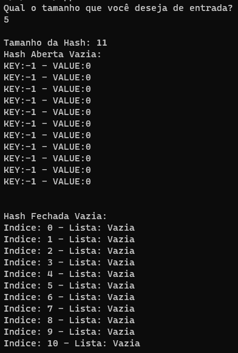
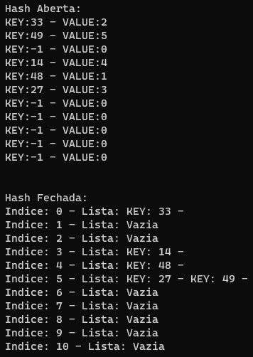
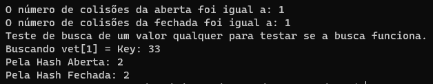

# Hash Dupla Aberta e Hash Fechada

## Conteúdos

 <a href="#apresentação">Apresentação</a> •
 <a href="#lógica-e-implementação">Lógica e Implementação</a> • 
 <a href="#saída">Saída</a> • 
 <a href="#discussão">Discussão</a> • 
 <a href="#bibliotecas">Bibliotecas</a> •
 <a href="#compilação-e-execução">Compilação e Execução</a> • 
 <a href="#autor">Autor</a>

---

## Apresentação

Foi proposto pelo professor [Michel Pires da Silva](http://lattes.cnpq.br/1449902596670082) da matéria de `Algoritmos e Estrutura de Dados 1 do 3º Período do curso de Engenharia da Computação` um exercício utilizando a estrutura Hash.

Implementação de duas tabelas hash: 

   1. Endereçamento fechado e; 
   2. Endereçamento aberto por hash dupla. 

O trabalho deve receber diretamente no seu código um vetor de no mínimo 20 valores inteiros, os quais serão utilizados como entrada para as duas estruturas que, por sua vez, são criadas com o dobro do tamanho do vetor (i.e., número primo maior que esse valor dobro). Feito isso, como resultado da execução deve-se apresentar o número de colisões ocorridas para ambas as estruturas quando o mesmo vetor é armazenado. Por fim, contemplar no README.md uma breve discussão dos motivos que levaram uma estrutura a apresentar melhores resultados. 

---

## Lógica e Implementação

Para a solução desse problema proposto, utilizei a [Hash Table](https://github.com/mpiress/HashTable) disponibilizada pelo professor. Essa Hash Table é aberta e simples. Assim, não só era necessário transformá-la em Hash Dupla, como criar outra Fechada.

Antes de modificar em si a Tabela Hash do professor, apesar de ser requerido no trabalho que fosse um vetor de no mínimo 20 valores inteiros, o código poderia ser de qualquer tamanho desejado pelo usuário (maior que 0, pois não é possível um vetor de tamanho negativo), para que assim a etapa de validação do tamanho da Tabela Hash fosse feito. Essa validação foi feita de maneira bem simples. Após o tamanho ser colocado, é calculado um valor 2x o seu tamanho + 1, este valor é verificado como sendo Primo ou não, se não for, é somado 1 e é verificado novamente. Este processo é realizado até que o número obtido seja primo.

Para transformar a Hash Simples em Dupla não era muito complicado, após o primeiro cálculo de Hash era simplesmente necessário realizar outro caso o primeiro caso não fosse validado. E caso mesmo este segundo caso não fosse validado, era necessário continuar somando 1 para ir aos poucos tentando colocar na Tabela Hash. Essa leve alteração foi feita na Inserção e na Leitura dos dados da Tabela Hash Aberta. O cálculo da Primeira Hash é o módulo da Key pelo tamanho da Hash, enquanto o cálculo da segunda Hash é o módulo do produto do número 42 pela Key, pois claramente 42 era a resposta para a vida o universo e tudo mais.

Para a contagem de colisões, na própria estrutura da Hash foi adicionado um novo inteiro, o Col (de colisões). Este valor é iniciado com 0 junto da Hash quando esta é criada. Sempre que um valor novo é inserido, 1 é somado neste valor a qualquer colisão que ocorra.

Para a criação da Hash Fechada foi necessária a criação de algumas estruturas adicionais. A Lista e o Bloco, para a criação destas estruturas, modificações feitas no [código base do professor](https://github.com/mpiress/dynamic_list) foram feitas. Essas alterações na estrutura da Hash são simples, ao contrário da Hash Aberta, onde cada posição da Hash Table armazenar um DataTable, cada posição da Hash Fechada armazena uma Lista de Blocos e cada Bloco armazena um DataTable. 

Como a Hash Fechada possui uma lista dinâmica em cada posição, é impossível a Hash Fechada ficar sem espaços, sendo assim não é necessário verificar se a Hash ficou cheia. Além de não ser necessário fazer uma Hash Dupla, pois onde o cálculo bater já é possível de inserir.

Igual a Hash Aberta, na Hash Fechada também foi adicionado o inteiro Col, para contar as colisões que ocorreriam. Ao contrário da Hash Table Aberta, a Hash Table Fechada só conta uma colisão para cada vez que se for inserir algum valor novo na Lista e ela já houver sido iniciada.

Por último, e sendo menos importante, foi implementada uma forma de busca para ambas as Hash's, por mera vontade do aluno, para verificar se elas funcionariam. Para isso uma Key qualquer entre as criadas aleatoriamente é sorteada para ser verificado se este valor realmente foi buscado corretamente pelas suas respectivas Hash's.

---

## Saída

Segue a representação gráfica de um exemplo de vetor de entrada tamanho 5:

 <i><b>Figura 1: </b>Começo da execução do programa</i>

 <i><b>Figura 2: </b>Hashs Preenchidas</i>

 <i><b>Figura 3: </b>Valores finais dados pelo programa</i>

Como uma única execução seria injusto, foram rodadas dez vezes para verificação de quais resultados seriam dados, isso para tamanhos de entrada 5, 20 e 50:

Entrada Tamanho 5:

| Tipo                |  1º Teste | 2º Teste |3º Teste  |4º Teste  |5º Teste  |6º Teste  |7º Teste  |8º Teste  |9º Teste  |10º Teste |  Média   |           
| --------------------| --------- |--------- |--------- |--------- |--------- |--------- |--------- |--------- |--------- |--------- |--------- |
| Aberta              | 1         |3         |0         |1         |5         |0         |4         |2         |0         |2         | 1,8      |
| Fechada             | 1         |2         |0         |1         |2         |0         |2         |1         |0         |2         | 1,1      |

Entrada Tamanho 20:

| Tipo                |  1º Teste | 2º Teste |3º Teste  |4º Teste  |5º Teste  |6º Teste  |7º Teste  |8º Teste  |9º Teste  |10º Teste |  Média   |           
| --------------------| --------- |---------|--------- |--------- |--------- |--------- |--------- |--------- |--------- |---------  |--------- |
| Aberta              | 20        |12       |34        |10        |17        |4         |18        |7         |7         |13         | 14,2     |
| Fechada             | 6         |6        |7         |5         |6         |2         |6         |3         |3         |3          | 4,7      |

Sim, também me assustei quando vi dois pares 7 e 3 em sequência.

Entrada Tamanho 50:

| Tipo                |  1º Teste | 2º Teste |3º Teste  |4º Teste  |5º Teste  |6º Teste  |7º Teste  |8º Teste  |9º Teste  |10º Teste |  Média   |           
| --------------------| --------- |--------- |--------- |--------- |--------- |--------- |--------- |--------- |--------- |--------- |--------- |
| Aberta              | 25        |18        |21        |12        |38        |17        |24        |18        |18        |19        | 21       |
| Fechada             | 11        |7         |10        |7         |14        |10        |10        |10        |10        |13        | 10,2     |

Nesse aqui eu também me assustei com a sequência de 10 e com os dois pares 18 e 10 em sequência.

Com os resultados da entrada de tamanho 50, foi testada uma entrada de 100.

| Tipo                |  1º Teste | 2º Teste |3º Teste  |4º Teste  |5º Teste  |6º Teste  |7º Teste  |8º Teste  |9º Teste  |10º Teste |  Média   |           
| --------------------| --------- |--------- |--------- |--------- |--------- |--------- |--------- |--------- |--------- |--------- |--------- |
| Aberta              | 41        |29        |35        |37        |40        |40        |29        |29        |22        |33        | 33,5     |
| Fechada             | 19        |14        |17        |21        |21        |17        |19        |17        |16        |21        | 18,2     |

Novamente, com os resultados da entrada de tamanho 100, foi testada uma entrada de tamanho 500.

| Tipo                |  1º Teste | 2º Teste |3º Teste  |4º Teste  |5º Teste  |6º Teste  |7º Teste  |8º Teste  |9º Teste  |10º Teste |  Média   |           
| --------------------| --------- |--------- |--------- |--------- |--------- |--------- |--------- |--------- |--------- |--------- |--------- |
| Aberta              | 203       |240       |249       |229       |239       |210       |215       |216       |246       |201       | 224,8    |
| Fechada             | 101       |122       |108       |107       |114       |108       |116       |99        |112       |106       | 109,3    |

---

## Discussão

Pelos resultados é possível verificar que o número de colisões em uma Hash Fechada é muito menor que o de uma Hash Aberta quando vamos para tamanhos de entradas maiores. Isso se deve a própria forma que a contagem é feita, possuindo uma estrutura um pouco mais complexa, a Hash Fechada impede que diferentes Keys colidam com Keys que possuam um cálculo Hash diferente do seu. Enquanto na Hash Aberta, dependendo de quão cheia estiver, é plenamente possível e até provável que Keys com diferentes resultados no cálculo da Hash comecem a colidir por precisarem sempre andar para frente, tornando seu valor bem maior.

Por isso, com o aumento da entrada é possível ver um aumento na diferença inicialmente, porém depois de um tempo, a diferença entre as duas hash parece se estabilizar. Ao se dividir a média da Hash Dupla com a Hash Fechada, se consegue os seguintes valores:

| Entrada        |  Razão   |           
| ---------------| ---------|
| 5              | 1,6363...|
| 20             | 3,02     |
| 50             | 2,06     |
| 100            | 1,84     |
| 500            | 2,06     |

Ao contrário do pensado pelo aluno enquanto executava os primeiros testes, a distância não se torna abismal com o tempo, se tornando até mesmo parelha, onde foi possível até pensar que chegariam a ser iguais e por isso teste com entradas maiores foram realizados, onde a cada tentativa parecia ir reduzindo a distância entre ambas as Hash. Foi notado, no entanto, que na verdade a razão entre ambos parece estagnar pelos testes feitos. Testes com Hashs gigantescas talvez provem o contrário, mas na amostragem do aluno percebe-se que a Fechada é sempre superior para adicionar os valores.

E para buscas, uma Hash Fechada também será mais efetiva, dado que ao cair numa posição, no máximo é necessário verificar os elementos daquela lista daquela posição específica. Enquanto numa Hash Aberta é possível ter que rodar a Hash inteira para achar o valor. Intuitivamente percebe-se que na busca a Fechada também teria uma média melhor. No entanto, como não era o foco do problema, não foram realizados testes nas buscas para ter a certeza.

Portanto, percebe-se que apesar de Hash Fechadas serem mais efetivas, não é como se uma Hash Aberta seja de se jogar fora, notando-se que é possível realizá-las até em tamanhos de entradas grandes, desde que se aceite aquela possível razão superior de número de colizões realizadas.

---

## Bibliotecas

Para o funcionamento do programa, é necessário incluir as seguintes bibliotecas: 
<ul>
    <li><code>#include 'stdlib.h'</code></li>
    <li><code>#include 'stdio.h'</code></li>
    <li><code>#include 'time.h'</code></li>
</ul>

---

## Compilação e Execução

O programa feito de acordo com a proposta possui um arquivo Makefile que realiza todo o procedimento de compilação e execução. Para tanto, temos as seguintes diretrizes de execução:

| Comando                |  Função                                                                                           |                     
| -----------------------| ------------------------------------------------------------------------------------------------- |
|  `make clean`          | Apaga a última compilação realizada contida na pasta build                                        |
|  `make`                | Executa a compilação do programa utilizando o gcc, e o resultado vai para a pasta build           |
|  `make run`            | Executa o programa da pasta build após a realização da compilação                                 |

---

## Autor

Elaborado por [Pedro Pinheiro de Siqueira](https://github.com/ppinheirosiqueira) 

Aluno do curso de `Engenharia da Computação` no [CEFET-MG - Campus V](https://www.divinopolis.cefetmg.br)
